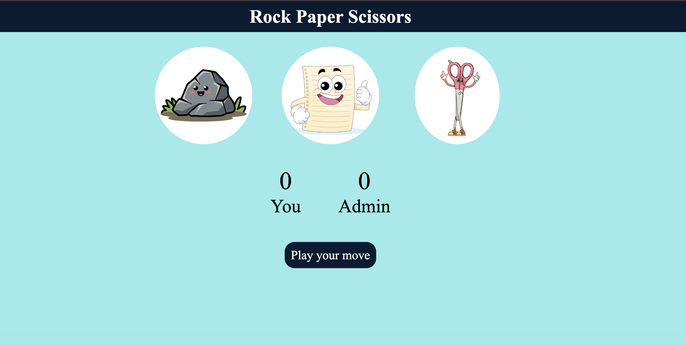

# Rock Paper Scissors Game ✊📄✂️

**Rock Paper Scissors** game built using **HTML**, **CSS**, and **JavaScript**.

## About this project 🚀

I created this project to **practice and understand core JavaScript concepts** such as DOM manipulation, event handling, conditional logic, and updating the UI dynamically based on user interaction.

The game allows the user to select between Rock, Paper, or Scissors, generates a random choice for the computer, compares both choices, and then displays the result (win, lose, or draw) along with score updates.

### Technologies 🛠️

- `HTML`
- `CSS`
- `JavaScript`

### 🎥 Demo / 🖼️ Screenshot

## Note

- Built for desktop — responsiveness not included.
